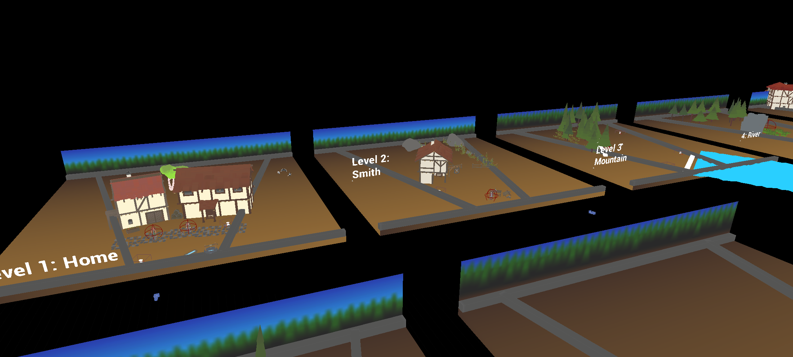
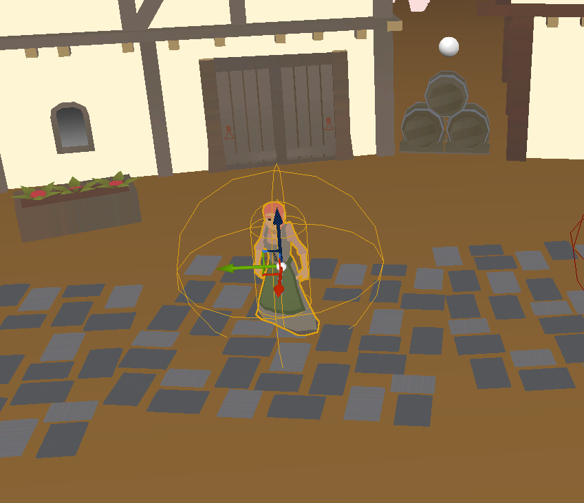
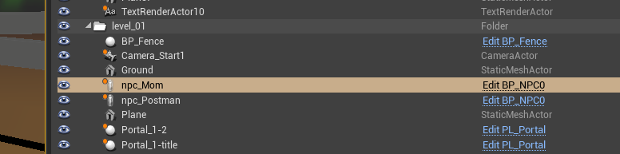
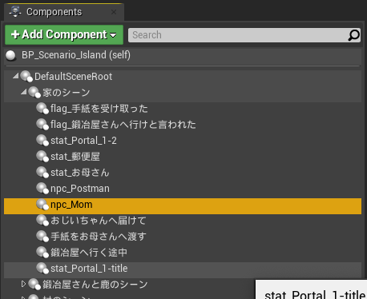
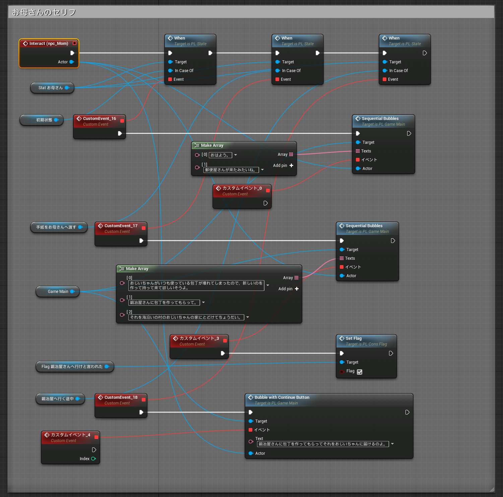
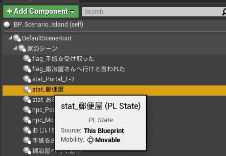
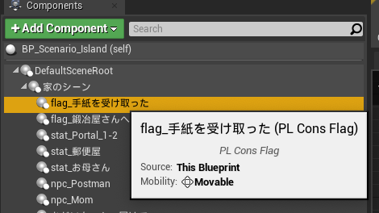
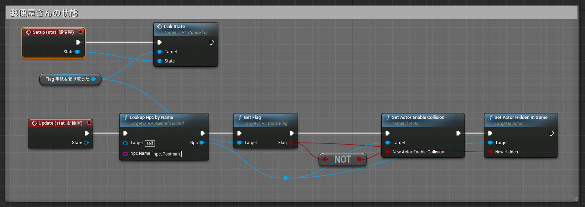

# PlayLogic: アドベンチャーゲームツールキット

Toru Hisai / Seaknot Studios

@torus

## マップの設定

### 全体

### NPC のアクターをレベルに置く

## シナリオ Blueprint の設定

### NPC コンポーネント

### 会話の内容

ステートごとに内容を設定する。

### ステートコンポーネント

### フラグコンポーネント

### ステートとフラグの関係

